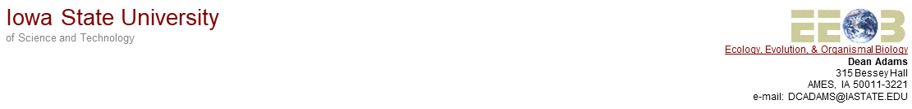
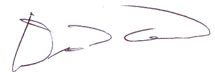

---
output:
  pdf_document:
    fig_caption: yes
    number_sections: no  #note: change to 'no' for most journals
    keep_tex: false

---

```{r setup, include=FALSE}
  library(knitr)
  knitr::opts_chunk$set(echo = TRUE)

```


```{r, echo = FALSE, fig.align='center', out.width="100%"}
  
```

`r format(Sys.time(), '%d %B, %Y')`
\hfill\break

Dr. Tim Connallon, Editor\hfill\break
*Evolution*

Dr. Connallon,

Please find attached our revised version of our manuscript titled "Evolution along allometric lines of least resistance: Morphological differentiation in *Pristurus* geckos" (MS #EVO-23-0020) which we are resubmitting for consideration for publication in *Evolution*. This manuscript is not being considered elsewhere for publication, and both authors are aware of this submission. \hfill\break

In this revision we have carefully considered the comments of both reviewers and the Associate Editor, and have made changes to address these concerns. In particular, we have performed a re-analysis of our within-species patterns of static allometry, to disentangle static and evolutionary allometry components; as per the AE and reviewer suggestions. Importantly, with this new set of analyses, all of the original biological conclusions remain robust. Thus, the general message of our paper remains the same, albeit with a more proper analytical framework.  \hfill\break

We have also substantially rewritten the manuscript to address the points made in review, which include placing our work in the broader context of the study of allometry, and linking our findings to other allometric studies and to potential biological causes of our observed patterns.  A version of our manuscript in 'track changes' mode shows all of our revisions, and a point-by-point response to all reviewer comments, and those of the Associate Editor, is attached.  \hfill\break

We hope you now find our work suitable for publication in the *Evolution*.

Sincerely,

```{r, echo = FALSE, fig.align='left', out.width="30%"}
  
```

Dean C. Adams, Distinguished Professor\hfill\break
Department of Ecology, Evolution, and Organismal Biology\hfill\break
Iowa State University
