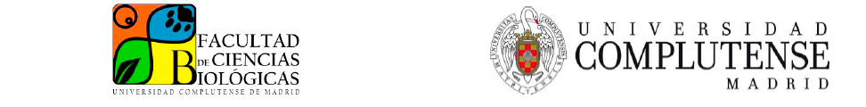
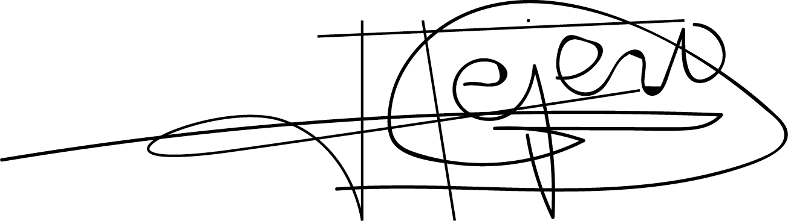

---
output:
  pdf_document:
    fig_caption: yes
    number_sections: no  #note: change to 'no' for most journals
    keep_tex: false

---

```{r setup, include=FALSE}
  library(knitr)
  knitr::opts_chunk$set(echo = TRUE)

```


```{r, echo = FALSE, fig.align='center', out.width="100%"}
  
```

```{r, include = FALSE}
format(Sys.setlocale("LC_TIME", "C"))
```

`r format(Sys.time(), '%d %B, %Y')`
\hfill\break

Dr. Tim Connallon, Editor\hfill\break
*Evolution*

Dr. Connallon,

Please find attached the revised version of our manuscript titled "Evolution along allometric lines of least resistance: Morphological differentiation in *Pristurus* geckos" (MS #EVO-23-0198) which we are resubmitting for consideration for publication in *Evolution*. This manuscript is not being considered elsewhere for publication, and all authors are aware of this submission. \hfill\break

In this second round of revision we have carefully considered the comments of both reviewers and the Associate Editor, and have made changes to address these concerns. In particular, we have changed the terminology of static allometry, which now we refer to as intraspecific allometry due to a potential conflation of the static and ontogenetic components, we have replaced the phylomorphospace in Figure 5 with a PCA of the size-standardized species means resulting from a non-phylogenetic regression, and we have added a table (new Table 1) showing the allometry vectors (evolutionary, intraspecific, and for each habitat). We have also modified several parts of the Discussion to make the interpretation of our results more cautious. Even though the general message and main results of our paper remain the same, we believe it is now greatly improved after considering all the points raised by the AE and reviewers. \hfill\break

A version of our manuscript in 'track changes' mode shows all of our revisions in the text, and a point-by-point response to all reviewer comments, and those of the Associate Editor, is attached.  \hfill\break

We hope you now find our work suitable for publication in *Evolution*.

Sincerely,

```{r, echo = FALSE, fig.align='left', out.width="30%"}
  
```

**Héctor Tejero-Cicuéndez**, *Juan de la Cierva* postdoctoral researcher\hfill\break
Evolution and Conservation Biology research Group\hfill\break 
Department of Biodiversity, Ecology and Evolution\hfill\break 
Faculty of Biology\hfill\break 
Universidad Complutense de Madrid\hfill\break 
28040 Madrid, Spain


