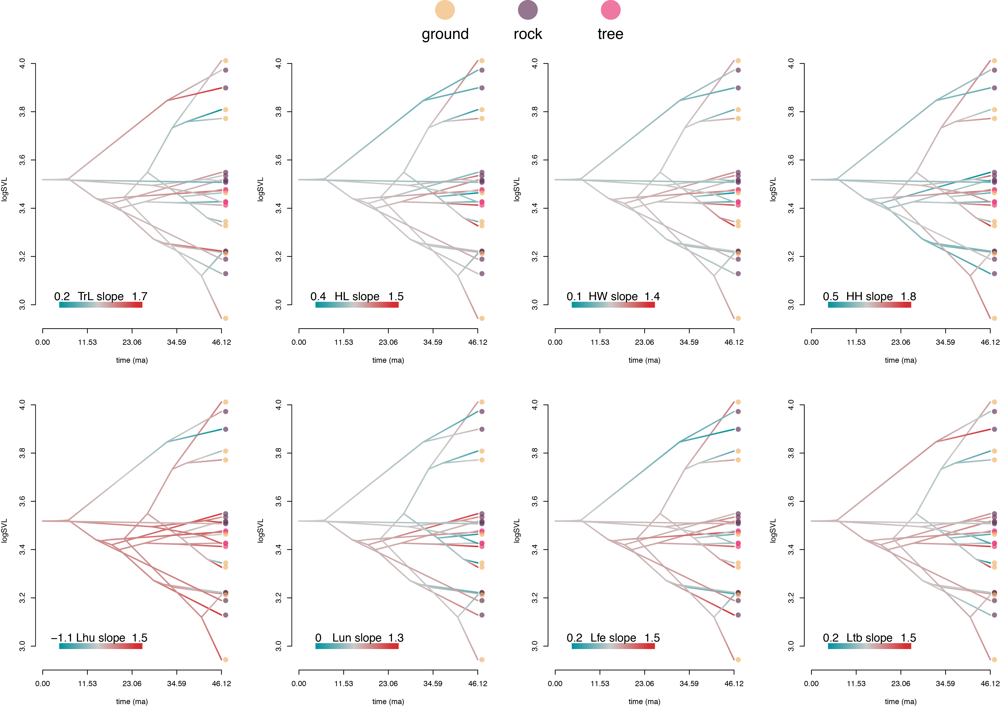
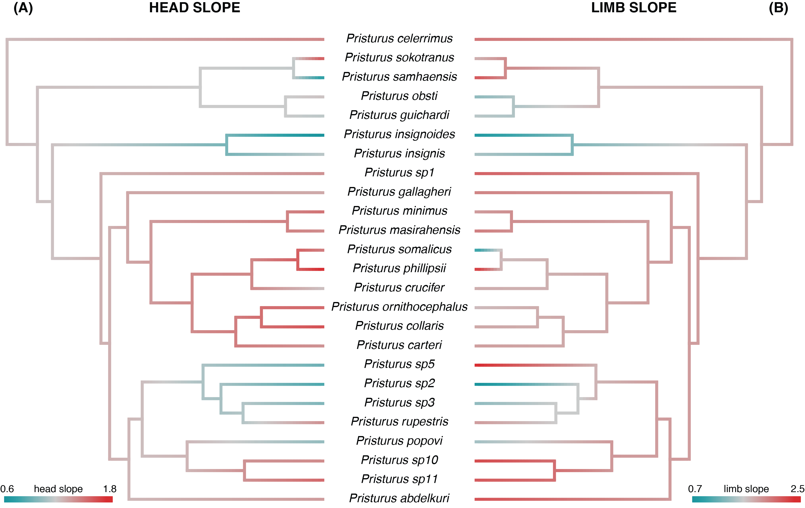

```{r setup, include=FALSE}
  library(knitr)
  library(kableExtra)
library(RRPP)
library(tidyverse)
  knitr::opts_chunk$set(echo = TRUE)
```

# 1: R-script of all computations presented in the article

Below is an R-script that may be used to reproduce all statistical analyses found in the paper. The data are found on DRYAD: (doi:10.5061/dryad.xwdbrv1f6 [@PristurusData]). Additional scripts used to generate publication-ready plots, and scripts for the additional plots found below, are found are available at **XXX**.

```{r, eval=FALSE, echo = TRUE}
libs <- c('geomorph', 'RRPP', 'phytools', 'geiger', 'tidyverse')
easypackages::libraries(libs)

# 0: Data Prep
data0 <- read.table('data/morpho/morpho_pristurus.csv', sep = ';', dec = '.', 
                    header = TRUE, stringsAsFactors = TRUE)
  sp.to.keep <- names(which(table(data0$species) >= 5))
data <- data0[data0$species %in% sp.to.keep, ]
  data$species <- droplevels(data$species)
  data$SVL <- log(data$SVL)
shape <- as.matrix(log(data[, 8:ncol(data)]))
rdf <- rrpp.data.frame(svl = data$SVL, shape = shape, habitat = data$habitat_broad, 
                       species = data$species)
tree0 <- read.nexus('data/phylogeny/pristurus_tree_final.nex')
LS.mns <- pairwise(lm.rrpp(shape~species, data = rdf, iter=0), 
                   groups = rdf$species)$LS.means[[1]]
sz.mn <- tapply(rdf$svl,rdf$species,mean)
hab.mn <- as.factor(by(rdf$habitat,rdf$species,unique))
levels(hab.mn) <- levels(rdf$habitat)
tree <- treedata(phy = tree0, data = LS.mns)$phy
C <- vcv.phylo(tree)

# 1: Evolutionary Allometry
allom.sp <- lm.rrpp(LS.mns~sz.mn, Cov = C)
allom.ind <- lm.rrpp(shape~svl, data = rdf)
anova(allom.sp)
anova(allom.ind)

M <-rbind(coef.sp <- allom.sp$LM$gls.coefficients[2,],
        coef.ind <- allom.ind$LM$coefficients[2,])

acos(RRPP:::vec.cor.matrix(M))*180/pi  #virtually parallel (angle of 1.49 degrees)

# 2: Comparison of multivariate allometry among habitat types
fit.hab <- lm.rrpp(shape~svl*habitat, data = rdf)
  anova(fit.hab)
pw.hab <- pairwise(fit.hab, groups = rdf$habitat, covariate = rdf$svl)
  summary(pw.hab, type = 'VC', stat.table = FALSE)

#Slopes by habitat
fit.coef <- fit.hab$LM$coefficients
ind.coef <- rbind(fit.coef[2,], fit.coef[2,]+fit.coef[5,], fit.coef[2,]+fit.coef[6,])
rownames(ind.coef) <- c("Ground","Rock", "Tree")
ind.coef

# 3: Map allometry slopes on phylogeny
head.scores <- two.b.pls(shape[, c(2:4)], rdf$svl)$XScores[, 1]
limb.scores <- two.b.pls(shape[, 5:8], rdf$svl)$XScores[, 1]

coef.head <- lm.rrpp(head.scores ~ rdf$svl*rdf$species)$LM$coefficients
coef.limb <- lm.rrpp(limb.scores ~ rdf$svl*rdf$species)$LM$coefficients

head.slp <- coef.head[grep('svl', rownames(coef.head)), ]
  head.slp[-1] <- head.slp[-1] + head.slp[1]
limb.slp <- coef.limb[grep('svl', rownames(coef.limb)), ]
  limb.slp[-1] <- limb.slp[-1] + limb.slp[1]
names(limb.slp) <- names(head.slp) <- levels(rdf$species)

cor(head.slp,limb.slp)
plot(head.slp,limb.slp)

contMap(tree = tree, x = head.slp, outline = FALSE)
cm.limb <- contMap(tree = tree, x = limb.slp, outline = FALSE)

# 4: phylomorphospace of size-standardized data (residuals)
shape.res <- residuals(allom.sp)
pca.w.phylo <- gm.prcomp(shape.res, phy = tree)
plot(pca.w.phylo, phylo = TRUE, pch = 21, bg = 'black', 
     phylo.par = list(node.labels = FALSE))
```

# 2: Additional Analyses and Visualizations

Here we provide additional analyses which complement those found in the article. 

### Inspection of Regression Coefficients (Slopes)

Here are the regression slopes for each habitat group, found from our linear model. These display differences in allometry among groups, variable by variable

```{r, eval=TRUE, echo = FALSE}
# 0: Data Prep
data0 <- read.table('Analyses/data/morpho/morpho_pristurus.csv', sep = ';', dec = '.', 
                    header = TRUE, stringsAsFactors = TRUE)
  sp.to.keep <- names(which(table(data0$species) >= 5))
data <- data0[data0$species %in% sp.to.keep, ]
  data$species <- droplevels(data$species)
  data$SVL <- log(data$SVL)
shape <- as.matrix(log(data[, 8:ncol(data)]))
rdf <- rrpp.data.frame(svl = data$SVL, shape = shape, habitat = data$habitat_broad, 
                       species = data$species)

```

```{r, eval = TRUE, echo = TRUE}
fit.hab <- lm.rrpp(shape~svl*habitat, data = rdf)
fit.coef <- fit.hab$LM$coefficients

coef.hab <- rbind(fit.coef[2,], #ground
  fit.coef[2,]+fit.coef[5,], #rock
  fit.coef[2,]+fit.coef[6,]) #tree 
rownames(coef.hab) <- c("Ground", "Rock", "Tree")

coef.hab
```


### Traitgrams of Individual Trait Allometry

In the main article we provided traitgrams of allometric slopes for composites of head traits (Figure 3A) and limb traits (Figure 3B). Here we provide trait grams for the allometric relationship of each body trait separately. As in the main article, traitgrams are visualized from an evolutionary mapping of body size (SVL), and the color represents changes in the allometric slope for each phenotypic trait, found from an evolutionary mapping of the species-level slopes under a Brownian motion model of evolution.

Here we see that XYZPDQ

```{r, fig.align="center",echo=FALSE, out.width="100%", fig.cap= "Traitgrams of regression slopes for each phenotypic variable. Colors designate habitat groups."}


```

### Evolutionary Mapping of Head & Limb Allometry

In the main article, allometric trends in both head dimensions were mapped onto the phylogeny under a Brownian motion model of evolution to discern macroevolutionary changes across the phylogeny. These were visualized on traitgrams, where body size differences were optimized (main article: Fig. 3). Here we present evolutionary mappings of allometric trends individually, so that increases and decreases in allometric slopes across the phylogeny are more readily interpreted. A summary of these patterns was described in the main article. 

Briefly, these plots show that changes in allometry were not concentrated to particular regions of the phylogeny, but rather displayed both increases and decreases in allometry of both the head traits and the limb traits occurred repeatedly in this group.
 
```{r, fig.align="center",echo=FALSE, out.width="100%", fig.cap= "Evolutionary mapping of regression slopes describing the relationship of (A) head morphology versus body size, and (B) limb proportions versus body size."}


```

\newpage

# References {-}

 \setlength{\parindent}{-0.25in}
 \setlength{\leftskip}{0.25in}
 \setlength{\parskip}{8pt}
 \noindent
 
<div id="refs"></div>

\newpage
