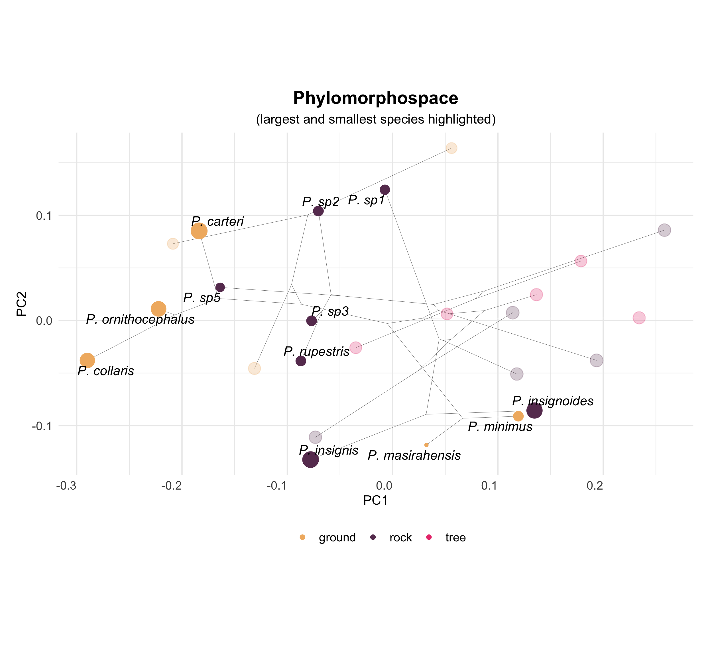

```{r setup, include=FALSE}
  library(knitr)
  library(kableExtra)
  library(tidyverse)
  knitr::opts_chunk$set(echo = TRUE)
```

\begin{center}
\textbf{ORDER TBD:  H{\'{e}}ctor Tejero-Cicu{\'{e}}ndez$^{1,*}$,  Iris Men{\'{e}}ndez$^{2,3}$, Salvador Carranza$^{1}$, and Dean C. Adams$^{4}$} 
\end{center}

\begin{center}`r format(Sys.time(), '%d %B, %Y')`\end{center}

$^{1}$Institute of Evolutionary Biology (CSIC-Universitat Pompeu Fabra), Passeig Marítim de la Barceloneta 37-49, Barcelona 08002, Spain

$^{2}$Departamento de Geodinámica, Estratigrafía y Paleontología, Facultad de Ciencias Geológicas,
Universidad Complutense de Madrid, C/José Antonio Novais 12, Madrid 28040, Spain

$^{3}$Departamento de Cambio Medioambiental, Instituto de Geociencias (UCM, CSIC), C/Severo Ochoa 7,
Madrid 28040, Spain

$^{4}$Department of Ecology, Evolution, and Organismal Biology, Iowa State University, Ames, Iowa, 50010 USA

$^{*}$Correspondence: Héctor Tejero-Cicuéndez cicuendez93@gmail.com

\hfill\break
**Keywords**: Phenotypic Evolution, Morphospace, Allometry, *Pristurus* geckos  \hfill\break

**Short Title**: XXX \hfill\break

**Author Contributions**:  All authors collaboratively developed the concept and contributed to all portions of this manuscript. HT-C, IM, and DCA performed the analyses. All authors approve of the final product and are willingly accountable for any portion of the content.\hfill\break

**Conflicts of Interests**:  The authors declare no conflicts of interest.\hfill\break

**Data Archiving**: Data are available on DRYAD (doi:10.5061/dryad.xwdbrv1f6 [@PristurusData]). R-scripts are found in the Supplemental Information. \hfill\break

**Acknowledgments**: We thank XYZPDQ... This work was sponsored in part by XXX (to SC) DCA was funded in part by National Science Foundation Grant DEB-2140720, and a Fulbright Senior Scholar Grant. 

\newpage

# Abstract

asdf

\newpage

# Introduction

some general paragraph on the evolution of phenotypic diversity \hfill\break


when organisms colonize new and unique habitats, they are subjected to novel ecological selection pressures in those habitats. Often these selective pressures elicit changes in body form, as organisms adapt to their new habitats (examples: some comment on ecomorphs, etc.).  .... leads to so-called ecomorphs, with such well known examples in Anolis lizards, cichlid fishes, etc.  It follows that ... Some comment on the fact that clades living in diverse ecological conditions often display greater diversity in form and function (REFS).

However, while the above patterns have been well documented in a variety of vertebrate taxa, what remains less known is how allometry plays a role in this phenotypic diversification.  We know that XYZPDQ (about allometry).  Then links to diversity.. 

The Afro-Arabian geckos in the genus *Pristurus* afford the opportunity to elucidate the interdigitating effects of allometry and habitat specialization on clade-level patterns of phenotypic diversity. Prior work on this system [@Tejero-Cicuendez2021] has revealed that ... (sentence or 2 about your prior study, getting to diversity and ... Importantly, ... something about habitat.  .... What remains unexamined however, is XYZPDQ...

In this study, we ...

# Materials and Methods

## Data

For this study, we combined phenotypic, phylogenetic, and ecological data to evaluate macroevolutionary trends in allometry, and to discern the extent to which those patterns differed across species occupying distinct ecological habitats. The data were obtained from our prior work on this system  [@Tejero-Cicuendez2021; @Tejero-Cicuendez2022], and are briefly described here. First we used a time-dated, molecular phylogeny that included all members of the genus *Pristurus*, including several currently undescribed taxa. The tree was estimated in a Bayesian framework, using five mitochondrial markers, six nuclear markers, and 21 calibration points [for details see @Tejero-Cicuendez2022]. Next we categorized each species as belonging to one of three ecological groups (ground, rock, or tree), based on descriptions in the literature [see @Tejero-Cicuendez2021]. Finally, we obtained a phenotypic data set containing body size (snout-vent length: SVL) and eight linear measurements (**Figure 1**) that described overall body form: trunk length (TrL), head length (HL), head width (HW), head height (HH), humerus length (Lhu), ulna length (Lun), femur length (Lfe), and tibia length (Ltb) [@Tejero-Cicuendez2021]. From the original dataset we restricted our study to those species represented by five or more individuals; resulting in a dataset of 687 individuals from 25 species (invidivuals per species: $\mu=27$; min = 9, max = 56). Species in the phenotypic dataset were then matched to the phylogeny, which was subsequently pruned to arrive at the final topology. All measurements were log-transformed prior to statistical analyses. Additional details regarding data collection and formal descriptions of each linear measurement may be found in the original sources [see @Tejero-Cicuendez2021; @Tejero-Cicuendez2022]. The data are found on DRYAD: https://doi.org/10.5061/dryad.xwdbrv1f6 [@PristurusData]. 

## Statistical Analyses

We conducted a series of statistical analyses to interrogate allometric trends, and macroevolutionary changes in allometry related to diversification in body form. First, to determine whether allometric trends in body form differed across habitat groups, we performed a multivariate analysis of covariance,  with body size (SVL), habitat, and SVL*habitat as model effects. Significance was evaluated using 999 iterations of a permutation procedure, where residuals from a reduced model were randomly permuted in each permutation (RRPP), model statistics were recalculated, and used to generate empirical null sampling distributions to evaluate the observed test statistics [following @Freedman1983; @CollyerAdams2007; @Collyer_et_al2015]. We then calculated the pairwise differences in angular direction in morphospace of the multivariate allometric vectors for the three habitat groups, and evaluated these using RRPP [sensu @CollyerAdams2007; @AdamsCollyer2009; @CollyerAdams2013]. Additionally, patterns of multivariate allometry were visualized via [sensu @DrakeKlingenberg2008] and predicted fitted values [sensu @AdamsNistri2010]. \hfill\break

Next we examined changes in allometric trends across the phylogeny by ..... 

- Examine allometry phylogenetically. 
  - PLS of head vs. SVL and limb vs SVL.  Obtained scores on 1st axis for each.
  - within-species regressions of Head.sc ~ SVL & limb.sc ~ SVL; obtained regression coefficients (slopes)
  - mapped slopes on phylogeny under BM and generated traitgrams to identify changes in allometric relationships across the phylogeny
  
Finally, to link   
- Finally, to link allometric patterns with trends in phenotypic diversification we obtained size-standardized species means, following procedures in H TC paper (residuals from phylo-regressions of traits on SVL, residuals). We then performed an ordination to obtain a phylomorphospace, where habitat types and species could be observed. 


All analyses were conducted in R 4.2.1 [@RCT], using `RRPP` version 1.3.1 [@CollyerAdams2018].


# Results

# Discussion

\newpage

# References {-}

 \setlength{\parindent}{-0.25in}
 \setlength{\leftskip}{0.25in}
 \setlength{\parskip}{8pt}
 \noindent
 
<div id="refs"></div>

\newpage

# Figures

Figure 1. Linear Measurements used in this study. SVL = snout-vent length, TL = trunk length, HL = head length, HW = head width, HH = head height, Lhu = humerus length, Lun = ulna length, Lfe = femur length, Ltb = tibia length [for details see @Tejero-Cicuendez2021]. \hfill\break

Figure 2. Plot of regression scores and predicted lines representing the relationship between linear body measurements and size (SVL). Individuals re colored by habitat use: rock (beige), ground (dark purple), and tree (magenta).  \hfill\break

Figure 3. Traitgrams showing the evolution of body size (SVL) through time based on the phylogenetic tree of *Pristurus*. Colors represent an evolutionary mapping of regression slopes describing the relationship of (A) head morphology versus body size, and (B) limb proportions versus body size (see text for descriptions). Species names are colored by habitat use: rock (beige), ground (dark purple), and tree (magenta). \hfill\break

Figure 4. Phylomorphospace of *Pristurus*, based on residuals from a phylogenetic regression of body measurements on size (SVL). Species means are colored by habitat use: rock (beige), ground (dark purple), and tree (magenta). Large and small rock-dwelling and ground-dwelling are highlighted with darker colors to highlight their differentiation and relative positions in morphospace. 

\newpage

```{r, fig.align="center", echo=FALSE, out.width="100%", fig.cap= "Linear Measurements used in this study. SVL = snout-vent length, TL = trunk length, HL = head length, HW = head width, HH = head height, Lhu = humerus length, Lun = ulna length, Lfe = femur length, Ltb = tibia length (for details see Tejero-Cicu{\'{e}}ndez et al. 2021a)."}

include_graphics("Figs/Fig1.png")
```

\newpage

```{r, echo=FALSE, out.width="100%", fig.cap= "Plot of regression scores and predicted lines representing the relationship between linear body measurements and size (SVL). Individuals re colored by habitat use: rock (beige), ground (dark purple), and tree (magenta)."}

include_graphics("Figs/figure_2_ggplot.png")
```

\newpage

```{r, echo = FALSE, out.width="100%", fig.cap = "Traitgrams showing the evolution of body size (SVL) through time based on the phylogenetic tree of \\textit{Pristurus}. Colors represent an evolutionary mapping of regression slopes describing the relationship of (A) head morphology versus body size, and (B) limb proportions versus body size (see text for descriptions). Species names are colored by habitat use: rock (beige), ground (dark purple), and tree (magenta)."}

include_graphics("Figs/figure_phenograms.png")
```

\newpage

```{r, echo = FALSE, out.width="100%", fig.cap = "Phylomorphospace of \\textit{Pristurus}, based on residuals from a phylogenetic regression of body measurements on size (SVL). Species means are colored by habitat use: rock (beige), ground (dark purple), and tree (magenta). Large and small rock-dwelling and ground-dwelling are highlighted with darker colors to highlight their differentiation and relative positions in morphospace."}


```
