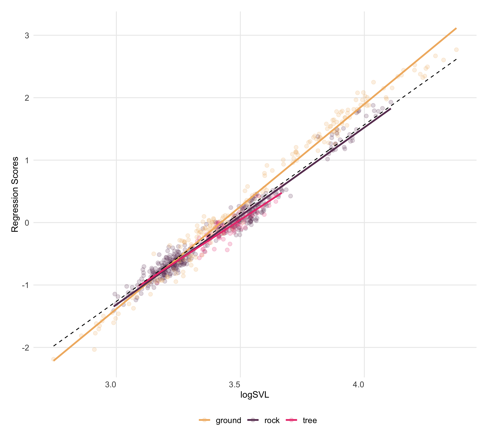

```{r setup, include=FALSE}
  library(knitr)
  library(kableExtra)
  library(tidyverse)
  knitr::opts_chunk$set(echo = TRUE)
```

\begin{center}
\textbf{ORDER TBD:  H{\'{e}}ctor Tejero-Cicu{\'{e}}ndez$^{1,*}$,  Iris Men{\'{e}}ndez$^{2,3}$, Salvador Carranza$^{1}$, and Dean C. Adams$^{4}$} 
\end{center}

\begin{center}`r format(Sys.time(), '%d %B, %Y')`\end{center}

$^{1}$Institute of Evolutionary Biology (CSIC-Universitat Pompeu Fabra), Passeig Marítim de la Barceloneta 37-49, Barcelona 08002, Spain

$^{2}$Departamento de Geodinámica, Estratigrafía y Paleontología, Facultad de Ciencias Geológicas,
Universidad Complutense de Madrid, C/José Antonio Novais 12, Madrid 28040, Spain

$^{3}$Departamento de Cambio Medioambiental, Instituto de Geociencias (UCM, CSIC), C/Severo Ochoa 7,
Madrid 28040, Spain

$^{4}$Department of Ecology, Evolution, and Organismal Biology, Iowa State University, Ames, Iowa, 50010 USA

$^{*}$Correspondence: Héctor Tejero-Cicuéndez cicuendez93@gmail.com

\hfill\break
**Keywords**: Phenotypic Evolution, Morphospace, Allometry, *Pristurus* geckos  \hfill\break

**Short Title**: XXX \hfill\break

**Author Contributions**:  All authors collaboratively developed the concept and contributed to all portions of this manuscript. HT-C, IM, and DCA performed the analyses. All authors approve of the final product and are willingly accountable for any portion of the content.\hfill\break

**Conflicts of Interests**:  The authors declare no conflicts of interest.\hfill\break

**Data Archiving**: Data are available on DRYAD (doi:10.5061/dryad.xwdbrv1f6 [@PristurusData]). R-scripts are available at **XXX**. \hfill\break

**Acknowledgments**: We thank XYZPDQ... This work was sponsored in part by XXX (to SC) DCA was funded in part by National Science Foundation Grant DEB-2140720, and a Fulbright Senior Scholar Grant. 

\newpage

# Abstract

asdf

\newpage

# Introduction

some general paragraph on the evolution of phenotypic diversity \hfill\break


when organisms colonize new and unique habitats, they are subjected to novel ecological selection pressures in those habitats. Often these selective pressures elicit changes in body form, as organisms adapt to their new habitats (examples: some comment on ecomorphs, etc.).  .... leads to so-called ecomorphs, with such well known examples in Anolis lizards, cichlid fishes, etc.  It follows that ... Some comment on the fact that clades living in diverse ecological conditions often display greater diversity in form and function (REFS).

However, while the above patterns have been well documented in a variety of vertebrate taxa, what remains less known is how allometry plays a role in this phenotypic diversification.  We know that XYZPDQ (about allometry).  Then links to diversity.. 

The Afro-Arabian geckos in the genus *Pristurus* afford the opportunity to elucidate the interdigitating effects of allometry and habitat specialization on clade-level patterns of phenotypic diversity. Prior work on this system [@Tejero-Cicuendez2021] has revealed that ... (sentence or 2 about your prior study, getting to diversity and ... Importantly, ... something about habitat.  .... What remains unexamined however, is XYZPDQ...

**last paragraph**
In this study, we used a combination of multivariate morphometric and phylogenetic comparative analysis to interrogate macroevolutionary patterns of evolutionary allometry in *Pristurus* geckos of Afro-Arabia. Using a combination of phenotypic, phylogenetic, and ecological data, we characterized allometric trends in body form to discern the extent to which those patterns differed across species occupying distinct ecological habitats, and to explore how allometric differences related to overall patterns of phenotypic diversification in the group. 

The independent diversification of both Socotran and continental taxa, the ecological and behavioural diversity and the unique phenotypic dataset compiled in this study, make this group of geckos an attractive model system to investigate keystone dynamics in evolutionary biology such as the island effect and ecological adaptation, and their impact on morphological evolution.

Our findings 

 Overall our work has ... (some implication).
 
 Our results demonstrate that differing tracectories of allometric growth can result in similar adult phenotypes... (Don't like it! We've got adults, yes? )

# Materials and Methods

## Data

We used a combination of phenotypic, phylogenetic, and ecological data to characterize and evaluate interspectific allometric trends. The data utilized here were obtained from our prior work on this system  [@Tejero-Cicuendez2021; @Tejero-Cicuendez2022], and are briefly described here. First we used a time-dated, molecular phylogeny that included all members of the genus *Pristurus*, including several currently undescribed taxa. The tree was estimated in a Bayesian framework, using five mitochondrial markers, six nuclear markers, and 21 calibration points [for details see @Tejero-Cicuendez2022]. Next we categorized each species as belonging to one of three ecological groups (ground, rock, or tree), based on descriptions of habitat use found in the literature [see @Tejero-Cicuendez2021]. Finally, we obtained a phenotypic data set containing body size (snout-vent length: SVL) and eight linear measurements (Figure 1) that described overall body form: trunk length (TrL), head length (HL), head width (HW), head height (HH), humerus length (Lhu), ulna length (Lun), femur length (Lfe), and tibia length (Ltb) [@Tejero-Cicuendez2021]. We restricted our study to those species represented by five or more individuals; resulting in a dataset of 687 individuals from 25 species (invidivuals per species: $\mu=27$; min = 9, max = 56). Species in the phenotypic dataset were then matched to the phylogeny, which was subsequently pruned to arrive at the final topology. All measurements were log-transformed prior to statistical analyses. Additional details regarding data collection and formal descriptions of each linear measurement may be found in the original sources [see @Tejero-Cicuendez2021; @Tejero-Cicuendez2022]. The data are found on DRYAD: https://doi.org/10.5061/dryad.xwdbrv1f6 [@PristurusData]. 

## Statistical and Comparative Analyses

**EVOLUTIONARY ALLOMETRY**  Do just shape ~ size & shape ~size for species | phylogeny

THen mancova....

- compare habitat slopes we found with individuals to those from species means (the 'usual' way of looking at evolutionary allometry)

We conducted a series of analyses to interrogate allometric trends and macroevolutionary changes in allometry, relative to diversification in body form. First, to determine whether allometric trends in body form differed across habitat groups, we performed a multivariate analysis of covariance,  with body size ($SVL$), $habitat$, and $SVL\times habitat$ as model effects. Significance was evaluated using 999 iterations of a permutation procedure, where residuals from a reduced model were randomly permuted in each permutation (RRPP), model statistics were recalculated, and used to generate empirical null sampling distributions to evaluate the observed test statistics [following @Freedman1983; @CollyerAdams2007; @Collyer_et_al2015]. Next we compared the multivariate allometric vectors for each habitat group by calculating pairwise differences in their angular direction in morphospace, and evaluating these relative to empirical sampling distributions obtained through RRPP [@CollyerAdams2007; @AdamsCollyer2009; @CollyerAdams2013]. We then visualized patterns of multivariate allometry relative to body size via regression scores [@DrakeKlingenberg2008] and predicted lines [@AdamsNistri2010], based on the coefficients and fitted values from the linear model described above. \hfill\break

Second, we examined changes in allometric trends across the phylogeny, treating the head dimensions and limb dimensions separately. Because both the head and limb data were multivariate, we accomplished this by first performing a partial least squares analysis [@Rohlf2000] of the head traits versus SVL, and the limb traits versus SVL, and retaining the PLS scores for each individual from the first dimension of this analysis. Species-specific slopes describing the extent of head and limb allometry within each species were then obtained from an analysis of covariance modeled as: $PLS1_{head} \sim SVL*species$ and $PLS1_{limb} \sim SVL*species$ respectively. Species' slopes were then mapped on the phylogeny of *Pristurus* using a Brownian motion model of evolution, to qualitatively evaluate shifts in allometry across species [for a similar approach see @AdamsNistri2010]. \hfill\break

Finally, to relate within-species allometric trends with patterns of phenotypic diversification in the group we generated a phylomorphospace, based on the size-standardized species means obtained from a phylogenetic regression [see @Tejero-Cicuendez2021]. Here, phenotypic similarities among species, relative to their phylogenetic relationships and habitat affiliations, were observed. All analyses were conducted in R 4.2.1 [@RCT], using `RRPP` version 1.3.1 [@CollyerAdams2018; @RRPP], and scripts written by the authors (available at **XXX**).

# Results

Our analyses revealed significant differences in the allometry of body form among *Pristurus* that utilized distinct habitats (Table 1). Further, comparisons of multivariate allometric vectors identified that ground-dwelling *Pristurus* displayed a distinct allometric trend as compared with *Pristurus* occupying both the rock and tree habitats (Table 2). A visualization of multivariate allometric trends (Fig. 2) confirmed these statistical findings, and indicated that the allometric trajectory in rock-dwelling animals was more extreme as compared with either ground or tree-dwelling *Pristurus*. Inspection of individual regression coefficients for each trait (Supplemental Information) further corroborated this, revealing steeper allometric coefficients for all head and limb traits in ground-dwelling *Pristurus* as compared with rock and tree-dwelling taxa. Overall, these findings revealed that larger individuals of ground-dwelling *Pristurus* species displayed proportionately larger heads and limbs, as compared with large individuals in taxa utilizing other habitat types. \hfill\break

Ground: head and body dimensions are more positively allometric (relative to SVL) than in rock/tree groups, and whereas allometric coefficients more similar in rock & tree.

Formally evaluated using PLS: confirming .......  WHen mapped on the phylogeny (....) Here traitgrams (by SVL) elucidated that heads more strongly allometric in XXX, implying that larger individuals of these species display proportionately larger heads relative to the 'typical' trend in the genus. By contrast, ... less strong (negative? ) allometry 

steeper/shallower slopes? resulting in ...

**Careful! use steeper slope, not positive/negative. 

When viewed in light of phylomorphospace....

# Discussion

\newpage

# References {-}

 \setlength{\parindent}{-0.25in}
 \setlength{\leftskip}{0.25in}
 \setlength{\parskip}{8pt}
 \noindent
 
<div id="refs"></div>

\newpage

```{r echo=FALSE, eval = TRUE}
library(RRPP)
data0 <- read.table('Analyses/data/morpho/morpho_pristurus.csv', sep = ';', dec = '.', header = TRUE)
  sp.to.keep <- names(which(table(data0$species) >= 5))
data <- data0[data0$species %in% sp.to.keep, ]
  data$species <- as.factor(data$species)
  data$habitat_broad <- as.factor(data$habitat_broad)  
  data$SVL <- log(data$SVL)
shape <- as.matrix(log(data[, 8:ncol(data)]))
rdf <- rrpp.data.frame(svl = data$SVL, shape = shape, habitat = data$habitat_broad, 
                       species = data$species)

# Comparison of multivariate allometry among habitat types
fit.hab <- lm.rrpp(shape~svl*habitat, data = rdf)
tb1 <- anova(fit.hab)$table

options(knitr.kable.NA = '')
kbl(tb1,align = "llllll", "latex", booktabs=TRUE,caption ="Multivariate analysis of covariance describing variation in body form in \textit{Pristurus}.", escape = FALSE) %>%
    kable_styling(latex_options = "HOLD_position")
```

\newpage

```{r echo=FALSE}
tb2 <- as.data.frame(matrix(c(0.000, 0.001, 0.001, 6.872, 0.000, 0.261, 3.657, 0.649, 0.000),ncol = 3, byrow = T))
rownames(tb2) <- colnames(tb2) <- c("Ground", "Rock", "Tree")
tb2[1,2] <- cell_spec(tb2[1, 2], bold = T)
tb2[1,3] <- cell_spec(tb2[1, 3], bold = T)
tb2[2,1] <- cell_spec(tb2[2, 1], bold = T)
tb2[3,1] <- cell_spec(tb2[3, 1], bold = T)

kbl(tb2,align = "llllll", "latex", booktabs=TRUE,caption ="Pairwise comparisons of multivariate allometry vectors. Effect sizes ($Z_{\\theta_{12}}$) based on pairwise differences in angular direction are below the diagonal, and their corresponding significance levels are above diagonal. Significant values in bold.", escape = FALSE) %>%
    kable_styling(latex_options = "HOLD_position")
```

\newpage


# Figures

Figure 1. Linear Measurements used in this study. SVL = snout-vent length, TL = trunk length, HL = head length, HW = head width, HH = head height, Lhu = humerus length, Lun = ulna length, Lfe = femur length, Ltb = tibia length [for details see @Tejero-Cicuendez2021]. \hfill\break

Figure 2. Plot of regression scores and predicted lines representing the relationship between linear body measurements and size (SVL). Individuals re colored by habitat use: rock (beige), ground (dark purple), and tree (magenta).  \hfill\break

Figure 3. Traitgrams showing the evolution of body size (SVL) through time based on the phylogenetic tree of *Pristurus*. Colors represent an evolutionary mapping of regression slopes describing the relationship of (A) head morphology versus body size, and (B) limb proportions versus body size (see text for descriptions). Species names are colored by habitat use: rock (beige), ground (dark purple), and tree (magenta). \hfill\break

Figure 4. Phylomorphospace of *Pristurus*, based on residuals from a phylogenetic regression of body measurements on size (SVL). Species means are colored by habitat use: rock (beige), ground (dark purple), and tree (magenta). Large and small rock-dwelling and ground-dwelling are highlighted with darker colors to highlight their differentiation and relative positions in morphospace. 

\newpage

```{r, fig.align="center", echo=FALSE, out.width="100%", fig.cap= "Linear Measurements used in this study. SVL = snout-vent length, TL = trunk length, HL = head length, HW = head width, HH = head height, Lhu = humerus length, Lun = ulna length, Lfe = femur length, Ltb = tibia length (for details see Tejero-Cicu{\'{e}}ndez et al. 2021a)."}

include_graphics("Figs/Fig1.png")
```

\newpage

```{r, echo=FALSE, out.width="100%", fig.cap= "Plot of regression scores and predicted lines representing the relationship between linear body measurements and size (SVL). Individuals re colored by habitat use: rock (beige), ground (dark purple), and tree (magenta)."}


```

\newpage

```{r, echo = FALSE, out.width="100%", fig.cap = "Traitgrams showing the evolution of body size (SVL) through time based on the phylogenetic tree of \\textit{Pristurus}. Colors represent an evolutionary mapping of regression slopes describing the relationship of (A) head morphology versus body size, and (B) limb proportions versus body size (see text for descriptions). Species names are colored by habitat use: rock (beige), ground (dark purple), and tree (magenta)."}


```

\newpage

```{r, echo = FALSE, out.width="100%", fig.cap = "Phylomorphospace of \\textit{Pristurus}, based on residuals from a phylogenetic regression of body measurements on size (SVL). Species means are colored by habitat use: rock (beige), ground (dark purple), and tree (magenta). Large and small rock-dwelling and ground-dwelling are highlighted with darker colors to highlight their differentiation and relative positions in morphospace."}

include_graphics("Figs/phylomorphospace_large_small.png")
```
